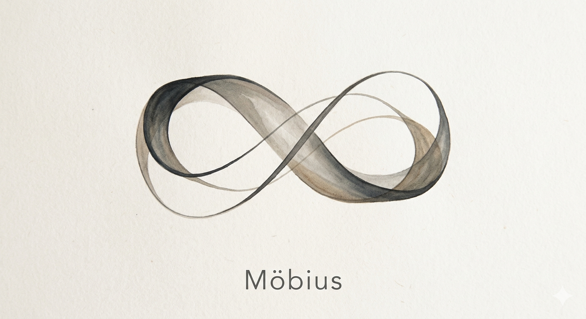
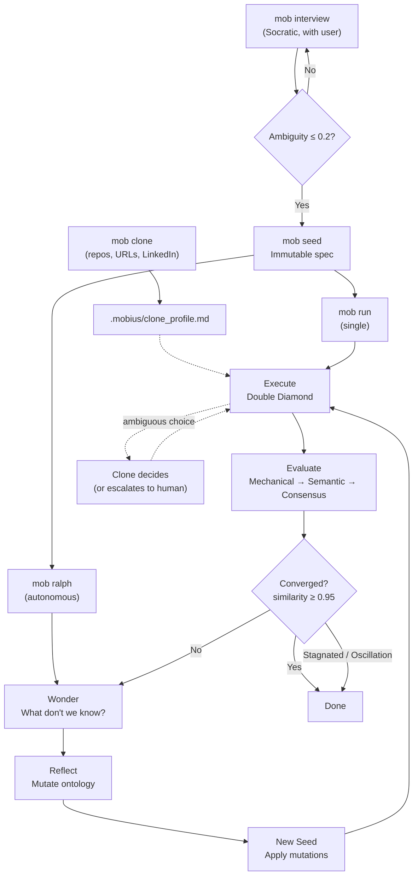

<p align="right">
  <a href="./README.md">English</a> | <strong>한국어</strong>
</p>

<p align="center">
  <br/>
  ◯ ─────────── ◯
  <br/><br/>
  
  <br/><br/>
  <strong>M O B I U S</strong>
  <br/><br/>
  ◯ ─────────── ◯
  <br/>
</p>


<p align="center">
  <strong>클론을 루프 안에 두세요.</strong>
  <br/>
  <sub>AI 코딩 에이전트를 위한 Clone-in-the-loop 워크플로우 엔진</sub>
</p>

<p align="center">
  <a href="LICENSE"></a>
</p>

<p align="center">
  <a href="#빠른-시작">Quick Start</a> ·
  <a href="#왜-möbius인가">Why</a> ·
  <a href="#결과물">Results</a> ·
  <a href="#순환-구조">How It Works</a> ·
  <a href="#명령어">Commands</a> ·
  <a href="#루프-이전-wonder에서-ontology로">Philosophy</a>
</p>

---

> **New: Clone Mode** — `mob clone`은 사용자의 선호, 결정, 작업 방식을 담은 디지털 클론을 만듭니다.
> Mobius는 클론을 루프 안에 유지합니다. 인터뷰, 시드, 평가 사이클 하나하나가 사용자의 사고 방식을 학습하여 — AI 에이전트가 사용자처럼 일할 수 있게 합니다.
>
> ```
> > mob clone                                        # 현재 프로젝트 분석
> > mob clone ~/projects/myapp                       # 다른 저장소 분석
> > mob clone https://github.com/user/repo           # GitHub 저장소 분석
> > mob clone https://linkedin.com/in/someone        # 역할 및 전문성 추출
> > mob clone ./myrepo https://someone.dev/blog      # 여러 소스를 자유롭게 혼합
> ```

---

**당신의 판단은 루프 안에 남습니다. 당신이 자리를 비워도.**

Mobius는 AI 코딩 에이전트에 clone-in-the-loop 레이어를 더합니다. 사용자의 선호, 코드 스타일, 과거 결정이 자율 반복 실행에서도 루프 안에 유지됩니다.

Mobius는 [Q00/ouroboros](https://github.com/Q00/ouroboros)에서 포크되어 소크라테스식 워크플로우와 온톨로지 엔진을 계승한 뒤, 다른 핵심 아이디어를 중심으로 발전했습니다: clone-in-the-loop.

---

## 왜 Möbius인가?

뫼비우스 띠는 종이를 한 번 비틀어 양 끝을 붙인 폐곡선입니다 — 안과 밖이 구분 없이 하나로 이어집니다. Mobius도 마찬가지입니다. 나와 내 디지털 클론이 하나의 루프 위에 있어서, 내가 빠져도 클론이 내 판단을 이어가며 작업은 멈추지 않습니다.

[Ralph](https://github.com/snarktank/ralph)는 자율 AI 루프가 작동한다는 것을 보여줬습니다. 다만 구현 중에 생기는 크고 작은 판단까지 요구사항에 담는 것은 어렵습니다. 컨텍스트가 부족한 Agent에 그 판단을 맡기면, 나비효과처럼 사소한 차이가 쌓여 결과물은 사용자의 의도에서 멀어집니다.

Möbius는 이 루프에 비틀림을 더합니다. 사용자의 이력과 코드 스타일을 반영한 디지털 클론이 루프 안에 함께합니다. 모호한 결정 앞에서 추측 대신 클론에게 묻습니다. **Clone-in-the-loop**.

---

## TODO

- 코드 히스토리를 넘어 클론 메모리를 확장하여, 단순히 인근 저장소뿐 아니라 프로젝트 전반의 과거 `plan` 및 `interview` 결정에서도 학습할 수 있도록 합니다.
- 이러한 사용자 결정들을 이후 추론을 위한 클론 메모리로 지속적으로 수집하는 선택적 백그라운드 수집 모드를 추가합니다.

---

## 빠른 시작

**설치** — 한 줄이면 전부 자동:

```bash
curl -fsSL https://raw.githubusercontent.com/tabtoyou/mobius/main/scripts/install.sh | bash
```

**시작** — AI 코딩 에이전트를 열고 바로:

```
> mob interview "I want to build a task management CLI"
```

> Claude Code와 Codex CLI 모두 지원합니다. 런타임 감지, MCP 서버 등록, 스킬 설치까지 자동으로 처리됩니다.

**클론 설정** — `mob pm`이나 `mob ralph`처럼 계획 중심 또는 자율 실행 전에:

```bash
mob clone
mob clone ~/projects/repo-a ~/projects/repo-b
```

이 명령은 `.mobius/clone_profile.md`를 생성하거나 갱신하여, `mob ralph` 및 관련 자율 루프 실행 중 Mobius가 모호한 결정을 디지털 클론을 통해 처리할 수 있게 합니다.

클론 결정은 기본적으로 영구 보존됩니다:

- 프로필과 작업 메모리는 `.mobius/` 아래에 저장됩니다
- 모든 결정은 `.mobius/clone-decisions.jsonl`에 추가됩니다
- 설정 시 Slack 또는 iMessage를 통한 알림을 받을 수 있습니다
- 클론 서브 에이전트에 오류가 발생하거나 유효한 결정을 반환하지 못하면, Ralph는 루프를 중단하지 않고 비차단 피드백 요청으로 전환합니다
- 클론이 사람의 피드백을 요청했으나 5분 내에 응답이 없으면, Ralph는 영원히 대기하지 않고 클론의 타임아웃 폴백으로 계속 진행합니다

<details>
<summary><strong>다른 설치 방법</strong></summary>

**Claude Code 플러그인만** (시스템 패키지 없이):
```bash
claude plugin marketplace add tabtoyou/mobius && claude plugin install mobius@mobius
```
Claude Code 세션 안에서 `mob setup` 실행.

**pip / uv / pipx**:
```bash
pip install mobius-ai                # 기본
pip install mobius-ai[claude]        # + Claude Code 의존성
pip install mobius-ai[litellm]       # + LiteLLM 멀티 프로바이더
pip install mobius-ai[all]           # 전부
mobius setup                         # 런타임 설정
```

런타임별 가이드: [Claude Code](./docs/runtime-guides/claude-code.md) · [Codex CLI](./docs/runtime-guides/codex.md)

</details>

<details>
<summary><strong>완전 삭제</strong></summary>

```bash
mobius uninstall
```

모든 설정, MCP 등록, 데이터를 제거합니다. 자세한 내용은 [UNINSTALL.md](./UNINSTALL.md)를 참고하세요.

</details>

> **Python >= 3.12 필요.** 전체 의존성 목록은 [pyproject.toml](./pyproject.toml)을 참고하세요.

---

## 결과물

Mobius가 매 반복마다 사용자의 판단을 유지하는 방법:

| 레이어 | 이전 | 이후 |
|:------|:-------|:------|
| **Interview** | *"Task CLI 만들어줘"* | 숨겨진 가정 12개 발굴, 모호성 점수 0.19로 감소 |
| **Clone-In-The-Loop** | 요구 사항이 떨어지면 에이전트가 임의로 기본값을 선택 | 디지털 클론이 과거 저장소/선호도를 참조하여 확신 시 결정, 필요 시 에스컬레이션, 모든 결정을 기록 |
| **Seed** | 명세 없음 | 수용 기준, 온톨로지, 제약 조건이 포함된 불변 명세 |
| **Evaluate** | 수동 검토 | 3단계 게이트: Mechanical (무료) → Semantic → Multi-Model Consensus |

<details>
<summary><strong>무슨 일이 일어났나요?</strong></summary>

```
interview  ->  소크라테스식 질문으로 숨겨진 가정 12개를 드러냄
clone*     ->  선택 사항: 자율 작업 중 모호한 선택을 처리할 디지털 프로필 준비
seed       ->  답변을 불변 명세로 구체화 (Ambiguity: 0.15)
run        ->  Double Diamond 분해를 통해 실행
evaluate   ->  3단계 검증: Mechanical -> Semantic -> Consensus
```

`clone*`은 계획 중심 또는 자율 실행을 위한 선택적 설정이며, 모든 Mobius 워크플로우에서 필수 단계는 아닙니다.

> AI 코딩 에이전트 세션 안에서 `mob <cmd>`를 사용하거나, 터미널에서 `mobius init start`, `mobius run seed.yaml` 등을 실행하세요.

루프 한 번이면 막연한 의도에서 작동하는 명세와 검증된 실행으로 이동할 수 있습니다. 다음 루프는 이전보다 강한 메모리에서 시작합니다. 자율 실행에서는 시드가 실제 구현 선택을 열어 둘 때마다 클론이 실행 과정에 개입할 수 있습니다.

</details>

---

## 다른 도구와의 비교

AI 코딩 도구는 무엇이든 만들 수 있습니다 — 하지만 루프 안에 사용자의 판단이 없으면, AI의 방식대로 만들지 사용자의 방식대로 만들지 않습니다.

| | 일반 AI 코딩 | Mobius |
|:--|:------------------|:---------|
| **모호한 프롬프트** | AI가 의도를 추측하고 가정 위에 만들어 냄 | 소크라테스식 인터뷰가 코드 작성 *전에* 명확성을 강제 |
| **모호한 구현 선택** | 에이전트가 조용히 기본값 선택 | Clone-in-the-loop가 사용자의 디지털 클론을 통해 결정을 처리하고, 필요 시 에스컬레이션·타임아웃 폴백·기록 |
| **명세 검증** | 명세 없음 — 아키텍처가 중간에 흔들림 | 불변 시드 명세가 의도를 고정; 모호성 게이트(≤ 0.2)가 섣부른 코드를 차단 |
| **평가** | "좋아 보임" / 수동 QA | 3단계 자동화 게이트: Mechanical → Semantic → Multi-Model Consensus |
| **재작업 비율** | 높음 — 잘못된 가정이 늦게 드러남 | 낮음 — 가정이 인터뷰에서 드러나며, PR 리뷰 때가 아님 |

---

## 순환 구조



각 세대는 반복이 아닙니다 — **진화**합니다. 평가 결과가 Wonder로 돌아가고, Wonder는 아직 모르는 것을 질문하며, Reflect가 다음 시드를 위해 온톨로지를 변이시킵니다. 클론은 Execute 안에서 모호한 결정을 처리합니다.

온톨로지 유사도 ≥ 0.95에 도달하면 수렴합니다 — 연속된 세대가 같은 스키마를 만들어낸 것입니다.

### Ralph: 멈추지 않는 루프

`mob ralph`는 수렴에 도달할 때까지 세션 경계를 넘어 지속적으로 진화 루프를 실행합니다. 각 단계는 **무상태(stateless)**입니다: EventStore가 전체 계보를 재구성하므로, 머신이 재시작되어도 루프는 마지막 안정 상태에서 재개됩니다. Ralph가 명세가 불충분한 선택에 부딪히면, Mobius는 그 결정을 범용 에이전트 판단에 맡기지 않고 사용자의 디지털 클론을 통해 처리할 수 있습니다.

클론이 활성화된 Ralph 실행에서:

- 클론은 단순한 단일 LLM 호출이 아니라, 경계가 있는 결정 서브 에이전트로 실행됩니다
- 현재 저장소, 인근 로컬 저장소, 사용 가능한 검색/패치 도구를 참조할 수 있습니다
- 감사 가능성을 위해 내구성 있는 결정 기록과 이벤트를 생성합니다
- 클론 서브 에이전트가 실패하거나 잘못된 출력을 반환하면, Ralph는 루프를 중단하지 않고 비차단 피드백 요청으로 전환합니다
- 사람의 피드백이 요청되면 Ralph는 질문을 한 번 표시하고, 5분 내에 응답이 없으면 클론의 타임아웃 폴백으로 계속 진행합니다

```
Ralph Cycle 1: evolve_step(lineage, seed) -> Gen 1 -> action=CONTINUE
Ralph Cycle 2: evolve_step(lineage)       -> Gen 2 -> action=CONTINUE
Ralph Cycle 3: evolve_step(lineage)       -> Gen 3 -> action=CONVERGED
                                                +-- Ralph 종료.
                                                    온톨로지가 안정됨.
```

---

## 명령어

AI 코딩 에이전트 세션 안에서는 `mob <cmd>` 스킬을 사용하세요. 터미널에서는 `mobius` CLI를 사용하세요.

| 스킬 (`mob`) | CLI 동등 명령 | 기능 |
|:---------------|:---------------|:-------------|
| `mob setup` | `mobius setup` | 런타임 등록 및 프로젝트 설정 (1회) |
| `mob interview` | `mobius init start` | 소크라테스식 질문 — 숨겨진 가정 드러내기 |
| `mob seed` | *(인터뷰에서 생성)* | 불변 명세로 구체화 |
| `mob run` | `mobius run seed.yaml` | Double Diamond 분해를 통해 실행 |
| `mob evaluate` | *(MCP 경유)* | 3단계 검증 게이트 |
| `mob evolve` | *(MCP 경유)* | 온톨로지 수렴까지 진화 루프 |
| `mob unstuck` | *(MCP 경유)* | 막혔을 때 활용 가능한 5가지 수평적 사고 페르소나 |
| `mob status` | `mobius status executions` / `mobius status execution <id>` | 세션 추적 + (MCP 전용) 드리프트 감지 |
| `mob clone` | *(플러그인 스킬)* | `mob ralph` 등 계획 또는 자율 실행 전에 디지털 클론 프로필 생성 또는 갱신 |
| `mob cancel` | `mobius cancel execution [<id>\|--all]` | 멈추거나 고아 상태가 된 실행 취소 |
| `mob ralph` | *(MCP 경유)* | 검증될 때까지 계속 도는 루프 |
| `mob tutorial` | *(대화형)* | 대화형 실습 |
| `mob help` | `mobius --help` | 전체 참조 |
| `mob pm` | *(MCP 경유)* | PM 중심 인터뷰 + PRD 생성 |
| `mob qa` | *(스킬 경유)* | 모든 아티팩트에 대한 범용 QA 판정 |
| `mob update` | `mobius update` | 업데이트 확인 + 최신 버전으로 업그레이드 |
| `mob brownfield` | *(스킬 경유)* | 기존 저장소 스캔 및 기본값 관리 |

> 모든 스킬에 직접적인 CLI 동등 명령이 있는 것은 아닙니다. 일부(`evaluate`, `evolve`, `unstuck`, `ralph`)는 에이전트 스킬 또는 MCP 도구를 통해서만 사용 가능합니다.

전체 내용은 [CLI 참조 문서](./docs/cli-reference.md)를 확인하세요.

---

## 아홉 개의 사고

아홉 개의 에이전트, 각자 다른 사고 방식. 필요할 때만 로드하며, 처음부터 다 띄워두지 않습니다:

| 에이전트 | 역할 | 핵심 질문 |
|:------|:-----|:--------------|
| **Socratic Interviewer** | 질문만 한다. 절대 만들지 않는다. | *"지금 뭘 가정하고 있지?"* |
| **Ontologist** | 증상이 아닌 본질을 찾는다 | *"이게 정확히 뭐지?"* |
| **Seed Architect** | 대화를 통해 스펙을 구체화한다 | *"완전하고 모호함이 없는가?"* |
| **Evaluator** | 3단계로 검증 | *"우리가 맞는 걸 만든 건가?"* |
| **Contrarian** | 모든 가정에 의문을 제기한다 | *"반대 상황이 사실이라면?"* |
| **Hacker** | 색다른 경로를 찾는다 | *"진짜 제약이 뭐지?"* |
| **Simplifier** | 복잡성을 제거한다 | *"돌아가는 것 중 제일 단순한 건?"* |
| **Researcher** | 코딩을 멈추고 조사를 시작한다 | *"실제로 근거가 있나?"* |
| **Architect** | 구조적 원인을 파악한다 | *"처음부터 다시 짜면 정말 이렇게 갈까?"* |

---

## 내부 구조

<details>
<summary><strong>아키텍처 개요 — Python >= 3.12</strong></summary>

```
src/mobius/
+-- bigbang/        Interview, 모호성 점수 산정, brownfield 탐색
+-- routing/        PAL Router — 3단계 비용 최적화 (1x / 10x / 30x)
+-- execution/      Double Diamond, 계층적 AC 분해
+-- evaluation/     Mechanical -> Semantic -> Multi-Model Consensus
+-- evolution/      Wonder / Reflect 순환, 수렴 감지
+-- resilience/     4가지 정체 패턴 감지, 5가지 측면 페르소나
+-- observability/  3요소 드리프트 측정, 자동 회고
+-- persistence/    Event Sourcing (SQLAlchemy + aiosqlite), 체크포인트
+-- orchestrator/   런타임 추상화 레이어 (Claude Code, Codex CLI)
+-- core/           타입, 에러, Seed, 온톨로지, 보안
+-- providers/      LLM/런타임 어댑터 (LiteLLM, Claude Code, Codex CLI)
+-- mcp/            MCP 클라이언트/서버 통합
+-- plugin/         플러그인 시스템 (스킬/에이전트 자동 탐색)
+-- tui/            터미널 UI 대시보드
+-- cli/            Typer 기반 CLI
```

**핵심 내부 구조:**
- **PAL Router** — Frugal (1x) → Standard (10x) → Frontier (30x), 실패 시 자동 상향, 성공 시 자동 하향
- **Drift** — Goal (50%) + Constraint (30%) + 온톨로지 (20%) 가중 측정, 임계값 ≤ 0.3
- **Brownfield** — 여러 언어 생태계의 설정 파일 자동 감지
- **Evolution** — 최대 30세대, 온톨로지 유사도 ≥ 0.95에서 수렴
- **Stagnation** — 스핀, 오실레이션, 드리프트 부재, 수익 감소 패턴 감지
- **런타임 백엔드** — 플러그형 추상화 레이어(`orchestrator.runtime_backend` 설정), Claude Code와 Codex CLI를 1등 지원; 동일한 워크플로우 명세, 다른 실행 엔진

전체 설계 문서는 [Architecture](./docs/architecture.md)를 참고하세요.

</details>

---

## 루프 이전: Wonder에서 Ontology로

<details>
<summary><strong>Interview와 Seed 뒤의 소크라테스 엔진</strong></summary>

> *아래 철학적 프레임워크는 [Q00/ouroboros](https://github.com/Q00/ouroboros)를 기반으로 합니다. Mobius는 여기에 clone-in-the-loop을 더합니다.*

> *Wonder → "어떻게 살아야 하는가?" → "'삶'이란 무엇인가?" → 온톨로지*
> — 소크라테스

모든 좋은 질문은 더 깊은 질문으로 이어지며 — 그 더 깊은 질문은 언제나 **온톨로지적**입니다: *"이걸 어떻게 하지?"*가 아니라 *"이게 정확히 뭐지?"*

```
   Wonder                         온톨로지
"내가 원하는 게 뭐지?"      →    "내가 원하는 게 정확히 뭐지?"
"Task CLI를 만들자"         →    "Task가 뭐지? Priority는 뭐지?"
"인증 버그를 고치자"        →    "이게 근본 원인일까, 아니면 증상일까?"
```

이것은 단순히 추상화를 위한 것이 아닙니다. *"Task가 뭐지?"*라는 질문에 답할 때 — 삭제 가능한 것인가, 보관 가능한 것인가? 혼자 하는 것인가, 팀으로 하는 것인가? — 재작업의 한 유형 전체를 없앨 수 있습니다. **온톨로지 질문이야말로 가장 실용적인 질문입니다.**

Mobius는 이 철학을 **Double Diamond** 구조로 풀어냅니다:

```
    * Wonder          * Design
   /  (diverge)      /  (diverge)
  /    explore      /    create
 /                 /
* ------------ * ------------ *
 \                 \
  \    define       \    deliver
   \  (converge)     \  (converge)
    * Ontology        * Evaluation
```

첫 번째 다이아몬드는 **소크라테스적**입니다: 질문을 넓히고, 온톨로지적 명확성으로 좁혀 갑니다. 두 번째 다이아몬드는 **실용적**입니다: 설계 옵션을 넓히고, 검증된 결과물로 좁혀 갑니다. 각 다이아몬드는 그 이전 단계가 없이는 성립할 수 없습니다 — 이해하지 못한 것은 설계할 수 없기 때문입니다.

</details>

---

## 루프 안에서: Clone-in-the-Loop

<details>
<summary><strong>Mobius가 더하는 것: 루프 안에 남는 판단</strong></summary>

Ouroboros는 *명세* 문제를 풀었습니다 — 막연한 아이디어를 코드 작성 전에 명확한 온톨로지로 만드는 것. 하지만 명세가 아무리 명확해도 구현 중에 열리는 결정은 무수히 많습니다.

명세에 *"태스크는 삭제 가능하다"*고 적혀 있습니다. 하지만 soft delete인지 hard delete인지, cascade 되는지, UI에서 어떻게 보이는지는 적혀 있지 않습니다. 이것은 명세의 모호함이 아닙니다 — 구현 중에야 비로소 드러나는 판단입니다.

한 세션 안에서는 사용자가 바로 답할 수 있습니다. 자율 루프에서는 그럴 수 없습니다. 여기서 Mobius가 ouroboros와 갈라집니다:

- **Ouroboros가 묻는 것**: *"이게 정확히 뭐지?"* — 그리고 명확한 명세를 만듭니다.
- **Mobius가 묻는 것**: *"여기서 당신이라면 어떻게 하겠는가?"* — 그리고 클론이 답합니다.

명세는 *무엇을 만들지*를 담습니다. 클론은 *어떻게 만들지*를 담습니다. 결과물이 나의 것이 되려면 둘 다 루프 안에 있어야 합니다.

</details>

<details>
<summary><strong>모호성 점수: Wonder와 코드 사이의 관문</strong></summary>

인터뷰는 느낌으로 끝나지 않습니다 — **수학**이 준비됐다고 할 때 끝납니다. Mobius는 모호성을 가중 명확도의 역수로 정량화합니다:

```
Ambiguity = 1 - Sum(clarity_i * weight_i)
```

각 차원은 LLM이 0.0~1.0 사이 점수를 매기고 (재현성을 위해 temperature 0.1), 여기에 가중치를 곱합니다:

| 차원 | Greenfield | Brownfield |
|:----------|:----------:|:----------:|
| **목표 명확도** — *목표가 구체적인가?* | 40% | 35% |
| **제약 명확도** — *제한 사항이 정의되었는가?* | 30% | 25% |
| **성공 기준** — *결과가 측정 가능한가?* | 30% | 25% |
| **컨텍스트 명확도** — *기존 코드베이스를 이해하고 있는가?* | — | 15% |

**임계값: Ambiguity <= 0.2** — 이 아래로 내려와야 Seed를 만들 수 있습니다.

```
예시 (Greenfield):

  Goal: 0.9 * 0.4  = 0.36
  Constraint: 0.8 * 0.3  = 0.24
  Success: 0.7 * 0.3  = 0.21
                        ------
  Clarity             = 0.81
  Ambiguity = 1 - 0.81 = 0.19  <= 0.2 -> Seed 생성 가능
```

왜 0.2일까요? 가중 명확도가 80%면 남은 불확실성이 작아서 코드 수준의 판단으로도 충분히 풀 수 있기 때문입니다. 그 임계값을 넘기면 아직 아키텍처를 감으로 정하는 단계에 가깝습니다.

</details>

<details>
<summary><strong>온톨로지 수렴: 루프가 멈추는 시점</strong></summary>

진화 루프는 끝없이 돌지 않습니다. 연속된 세대가 온톨로지적으로 같은 스키마를 만들면 거기서 멈춥니다. 유사도는 스키마 필드를 가중 비교해서 계산합니다:

```
Similarity = 0.5 * name_overlap + 0.3 * type_match + 0.2 * exact_match
```

| 구성 요소 | 가중치 | 측정 대상 |
|:----------|:------:|:-----------------|
| **Name overlap** | 50% | 두 세대에 같은 필드명이 존재하는가? |
| **Type match** | 30% | 공유 필드의 타입이 동일한가? |
| **Exact match** | 20% | 이름, 타입, 설명이 모두 동일한가? |

**임계값: Similarity >= 0.95** — 이 선을 넘으면 루프가 수렴하고 멈춥니다.

하지만 유사도만 보는 건 아닙니다. 시스템은 병리적인 패턴도 함께 감지합니다:

| 신호 | 조건 | 의미 |
|:-------|:----------|:--------------|
| **정체(Stagnation)** | 3세대 연속 유사도 >= 0.95 | 온톨로지가 안정됨 |
| **진동(Oscillation)** | Gen N ~ Gen N-2 (주기 2 순환) | 두 설계 사이에서 왕복 중 |
| **반복 피드백** | 3세대에 걸쳐 질문 중복률 >= 70% | Wonder가 같은 질문만 반복 중 |
| **Hard cap** | 30세대 도달 | 안전장치 |

```
Gen 1: {Task, Priority, Status}
Gen 2: {Task, Priority, Status, DueDate}     -> similarity 0.78 -> CONTINUE
Gen 3: {Task, Priority, Status, DueDate}     -> similarity 1.00 -> CONVERGED
```

두 개의 수학적 게이트, 하나의 철학: **충분히 분명해질 때까지는 만들지 않고 (Ambiguity <= 0.2), 안정될 때까지는 진화를 계속합니다 (Similarity >= 0.95).**

</details>

---

## 기여하기

```bash
git clone https://github.com/tabtoyou/mobius
cd mobius
uv sync --all-groups && uv run pytest
```

[이슈](https://github.com/tabtoyou/mobius/issues) · [토론](https://github.com/tabtoyou/mobius/discussions) · [기여 가이드](./CONTRIBUTING.md)

<!--
---

## Star History

<a href="https://www.star-history.com/?repos=tabtoyou/mobius&type=Date#gh-light-mode-only">
  
</a>
<a href="https://www.star-history.com/?repos=tabtoyou/mobius&type=Date#gh-dark-mode-only">
  
</a>
-->

---

<p align="center">
  <em>"사용자는 루프를 완전히 떠나지 않습니다."</em>
  <br/><br/>
  <strong>Mobius는 혼자 추측하지 않습니다. 클론을 루프 안에 둡니다.</strong>
  <br/><br/>
  <code>MIT License</code>
</p>
