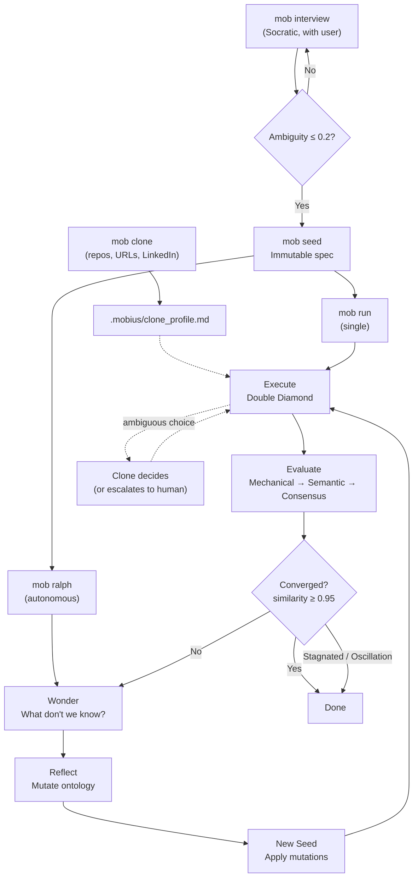

<p align="right">
  <strong>English</strong> | <a href="./README.ko.md">한국어</a>
</p>

<p align="center">
  <br/>
  ◯ ─────────── ◯
  <br/><br/>
  
  <br/><br/>
  <strong>M O B I U S</strong>
  <br/><br/>
  ◯ ─────────── ◯
  <br/>
</p>


<p align="center">
  <strong>Keep your clone in the loop.</strong>
  <br/>
  <sub>Clone-in-the-loop workflow engine for AI coding agents</sub>
</p>

<p align="center">
  <a href="LICENSE"></a>
</p>

<p align="center">
  <a href="#quick-start">Quick Start</a> ·
  <a href="#why-mobius">Why</a> ·
  <a href="#what-you-get">Results</a> ·
  <a href="#the-loop">How It Works</a> ·
  <a href="#commands">Commands</a> ·
  <a href="#before-the-loop-from-wonder-to-ontology">Philosophy</a>
</p>

---

> **New: Clone Mode** — `mob clone` builds a digital clone of your preferences, decisions, and working style.
> Mobius keeps your clone in the loop: every interview, seed, and evaluation cycle learns how you think — so the AI agent works the way you do.
>
> ```
> > mob clone                                        # analyze current project
> > mob clone ~/projects/myapp                       # analyze another repo
> > mob clone https://github.com/user/repo           # analyze a GitHub repo
> > mob clone https://linkedin.com/in/someone        # extract role & expertise
> > mob clone ./myrepo https://someone.dev/blog      # mix sources freely
> ```

---

**Your judgment stays in the loop, even when you don't.**

Mobius adds a clone-in-the-loop layer to your AI coding agent. Your preferences, code style, and past decisions stay inside the loop, even across autonomous iterations.

Mobius began as a fork of [Q00/ouroboros](https://github.com/Q00/ouroboros), inheriting its Socratic workflow and ontological engine, then diverged around a different core idea: clone-in-the-loop.

---

## Why Möbius?

A Möbius strip is a closed curve with a single twist — inside and outside flow into each other without a break. That is how Mobius works. You and your digital clone share the same loop: when you step away, the clone carries your judgment forward, and the loop never stops.

[Ralph](https://github.com/snarktank/ralph) proved that autonomous AI loops work: define requirements up front, let the loop iterate until every task passes. Each iteration spawns a new AI instance with clean context, and continuity lives in git history and a progress file.

But requirements can't capture every judgment call that comes up during implementation. When an agent without enough context fills those gaps, small differences compound like a butterfly effect, and the result drifts from what you would have built yourself.

**Möbius** is the twist in that loop. A digital clone shaped by your past projects, code style, and working patterns sits inside every iteration. When the loop hits an ambiguous decision, it asks the clone instead of guessing. **Clone-in-the-loop**.

---

## TODO

- Extend clone memory beyond code history so it can learn from past `plan` and `interview` decisions across projects, not just nearby repositories.
- Add an optional background ingestion mode that continuously captures those user decisions into clone memory for later inference.

---

## Quick Start

**Install** — one command, everything auto-detected:

```bash
curl -fsSL https://raw.githubusercontent.com/tabtoyou/mobius/main/scripts/install.sh | bash
```

**Build** — open your AI coding agent and go:

```
> mob interview "I want to build a task management CLI"
```

> Works with Claude Code and Codex CLI. The installer detects your runtime, registers the MCP server, and installs skills automatically.

**Set up your clone** — before planning-heavy or autonomous runs such as `mob pm` and `mob ralph`:

```bash
mob clone
mob clone ~/projects/repo-a ~/projects/repo-b
```

This builds or refreshes `.mobius/clone_profile.md` so Mobius can route ambiguous decisions through your digital clone during `mob ralph` and related autonomous loops.

Clone decisions are durable by default:

- profile and working memory live under `.mobius/`
- every decision is appended to `.mobius/clone-decisions.jsonl`
- best-effort notifications can be sent through Slack or iMessage when configured
- if the clone sub-agent errors or cannot return a valid decision, Ralph degrades to a non-blocking feedback request instead of failing closed
- if the clone escalates for human feedback and no reply arrives within 5 minutes, Ralph continues with the clone's timeout fallback instead of blocking forever

<details>
<summary><strong>Other install methods</strong></summary>

**Claude Code plugin only** (no system package):
```bash
claude plugin marketplace add tabtoyou/mobius && claude plugin install mobius@mobius
```
Then run `mob setup` inside a Claude Code session.

**pip / uv / pipx**:
```bash
pip install mobius-ai                # base
pip install mobius-ai[claude]        # + Claude Code deps
pip install mobius-ai[litellm]       # + LiteLLM multi-provider
pip install mobius-ai[all]           # everything
mobius setup                         # configure runtime
```

See runtime guides: [Claude Code](./docs/runtime-guides/claude-code.md) · [Codex CLI](./docs/runtime-guides/codex.md)

</details>

<details>
<summary><strong>Uninstall</strong></summary>

```bash
mobius uninstall
```

Removes all configuration, MCP registration, and data. See [UNINSTALL.md](./UNINSTALL.md) for details.

</details>

> **Python >= 3.12 required.** See [pyproject.toml](./pyproject.toml) for the full dependency list.

---

## What You Get

How Mobius keeps your judgment in every iteration:

| Layer | Before | After |
|:------|:-------|:------|
| **Interview** | *"Build me a task CLI"* | 12 hidden assumptions exposed, ambiguity scored to 0.19 |
| **Clone-In-The-Loop** | Agent invents defaults when requirements run out | Digital clone can inspect prior repos/preferences, choose when confident, escalate when needed, and log every decision |
| **Seed** | No spec | Immutable specification with acceptance criteria, ontology, constraints |
| **Evaluate** | Manual review | 3-stage gate: Mechanical (free) -> Semantic -> Multi-Model Consensus |

<details>
<summary><strong>What just happened?</strong></summary>

```
interview  ->  Socratic questioning exposed 12 hidden assumptions
clone*     ->  Optional: prepared a digital profile to route ambiguous choices during autonomous work
seed       ->  Crystallized answers into an immutable spec (Ambiguity: 0.15)
run        ->  Executed via Double Diamond decomposition
evaluate   ->  3-stage verification: Mechanical -> Semantic -> Consensus
```

`clone*` is optional setup for planning-heavy or autonomous runs; it is not a mandatory phase in every Mobius workflow.

> Use `mob <cmd>` inside your AI coding agent session, or `mobius init start`, `mobius run seed.yaml`, etc. from the terminal.

One loop is enough to move from vague intent to a working spec and verified execution. The next loop starts from a stronger memory than the last. In autonomous runs, the clone can interleave with execution whenever the seed leaves a real implementation choice open.

</details>

---

## How It Compares

AI coding tools can build anything -- but without your judgment in the loop, they build it their way, not yours.

| | Vanilla AI Coding | Mobius |
|:--|:------------------|:---------|
| **Vague prompt** | AI guesses intent, builds on assumptions | Socratic interview forces clarity *before* code |
| **Ambiguous implementation choices** | Agent silently chooses defaults | Clone-in-the-loop routes decisions through the user's digital clone, with escalation, timeout fallback, and logging when needed |
| **Spec validation** | No spec -- architecture drifts mid-build | Immutable seed spec locks intent; Ambiguity gate (<= 0.2) blocks premature code |
| **Evaluation** | "Looks good" / manual QA | 3-stage automated gate: Mechanical -> Semantic -> Multi-Model Consensus |
| **Rework rate** | High -- wrong assumptions surface late | Low -- assumptions surface in the interview, not in the PR review |

---

## The Loop



Each generation does not repeat -- it **evolves**. Evaluation feeds back into Wonder, which questions what is still unknown, and Reflect mutates the ontology for the next seed. Clone handles ambiguous decisions within Execute.

Convergence is reached when ontology similarity >= 0.95 -- when consecutive generations produce the same schema.

### Ralph: The Loop That Never Stops

`mob ralph` runs the evolutionary loop persistently -- across session boundaries -- until convergence is reached. Each step is **stateless**: the EventStore reconstructs the full lineage, so even if your machine restarts, the loop resumes from the latest stable state. When Ralph hits an underspecified choice, Mobius can route that decision through the user's digital clone instead of leaving it to generic agent preference.

In clone-enabled Ralph runs:

- the clone runs as a bounded decision sub-agent, not just a single LLM call
- it can inspect the current repo, nearby local repos, and available search/fetch tools
- it emits durable decision records and events for auditability
- if the clone sub-agent fails or returns malformed output, Ralph degrades to a non-blocking feedback request instead of crashing the loop
- if human feedback is requested, Ralph surfaces the question once and then continues with the clone's timeout fallback after 5 minutes if no reply arrives

```
Ralph Cycle 1: evolve_step(lineage, seed) -> Gen 1 -> action=CONTINUE
Ralph Cycle 2: evolve_step(lineage)       -> Gen 2 -> action=CONTINUE
Ralph Cycle 3: evolve_step(lineage)       -> Gen 3 -> action=CONVERGED
                                                +-- Ralph stops.
                                                    The ontology has stabilized.
```

---

## Commands

Inside AI coding agent sessions, use `mob <cmd>` skills. From the terminal, use the `mobius` CLI.

| Skill (`mob`) | CLI equivalent | What It Does |
|:---------------|:---------------|:-------------|
| `mob setup` | `mobius setup` | Register runtime and configure project (one-time) |
| `mob interview` | `mobius init start` | Socratic questioning -- expose hidden assumptions |
| `mob seed` | *(generated by interview)* | Crystallize into immutable spec |
| `mob run` | `mobius run seed.yaml` | Execute via Double Diamond decomposition |
| `mob evaluate` | *(via MCP)* | 3-stage verification gate |
| `mob evolve` | *(via MCP)* | Evolutionary loop until ontology converges |
| `mob unstuck` | *(via MCP)* | 5 lateral thinking personas when you are stuck |
| `mob status` | `mobius status executions` / `mobius status execution <id>` | Session tracking + (MCP-only) drift detection |
| `mob clone` | *(plugin skill)* | Build or refresh the digital clone profile before planning or autonomous runs like `mob ralph` |
| `mob cancel` | `mobius cancel execution [<id>\|--all]` | Cancel stuck or orphaned executions |
| `mob ralph` | *(via MCP)* | Persistent loop until verified |
| `mob tutorial` | *(interactive)* | Interactive hands-on learning |
| `mob help` | `mobius --help` | Full reference |
| `mob pm` | *(via MCP)* | PM-focused interview + PRD generation |
| `mob qa` | *(via skill)* | General-purpose QA verdict for any artifact |
| `mob update` | `mobius update` | Check for updates + upgrade to latest |
| `mob brownfield` | *(via skill)* | Scan and manage brownfield repo defaults |

> Not all skills have direct CLI equivalents. Some (`evaluate`, `evolve`, `unstuck`, `ralph`) are available through agent skills or MCP tools only.

See the [CLI reference](./docs/cli-reference.md) for full details.

---

## The Nine Minds

Nine agents, each a different mode of thinking. Loaded on-demand, never preloaded:

| Agent | Role | Core Question |
|:------|:-----|:--------------|
| **Socratic Interviewer** | Questions-only. Never builds. | *"What are you assuming?"* |
| **Ontologist** | Finds essence, not symptoms | *"What IS this, really?"* |
| **Seed Architect** | Crystallizes specs from dialogue | *"Is this complete and unambiguous?"* |
| **Evaluator** | 3-stage verification | *"Did we build the right thing?"* |
| **Contrarian** | Challenges every assumption | *"What if the opposite were true?"* |
| **Hacker** | Finds unconventional paths | *"What constraints are actually real?"* |
| **Simplifier** | Removes complexity | *"What's the simplest thing that could work?"* |
| **Researcher** | Stops coding, starts investigating | *"What evidence do we actually have?"* |
| **Architect** | Identifies structural causes | *"If we started over, would we build it this way?"* |

---

## Under the Hood

<details>
<summary><strong>Architecture overview -- Python >= 3.12</strong></summary>

```
src/mobius/
+-- bigbang/        Interview, ambiguity scoring, brownfield explorer
+-- routing/        PAL Router -- 3-tier cost optimization (1x / 10x / 30x)
+-- execution/      Double Diamond, hierarchical AC decomposition
+-- evaluation/     Mechanical -> Semantic -> Multi-Model Consensus
+-- evolution/      Wonder / Reflect cycle, convergence detection
+-- resilience/     4-pattern stagnation detection, 5 lateral personas
+-- observability/  3-component drift measurement, auto-retrospective
+-- persistence/    Event sourcing (SQLAlchemy + aiosqlite), checkpoints
+-- orchestrator/   Runtime abstraction layer (Claude Code, Codex CLI)
+-- core/           Types, errors, seed, ontology, security
+-- providers/      LLM/runtime adapters (LiteLLM, Claude Code, Codex CLI)
+-- mcp/            MCP client/server integration
+-- plugin/         Plugin system (skill/agent auto-discovery)
+-- tui/            Terminal UI dashboard
+-- cli/            Typer-based CLI
```

**Key internals:**
- **PAL Router** -- Frugal (1x) -> Standard (10x) -> Frontier (30x) with auto-escalation on failure, auto-downgrade on success
- **Drift** -- Goal (50%) + Constraint (30%) + Ontology (20%) weighted measurement, threshold <= 0.3
- **Brownfield** -- Auto-detects config files across multiple language ecosystems
- **Evolution** -- Up to 30 generations, convergence at ontology similarity >= 0.95
- **Stagnation** -- Detects spinning, oscillation, no-drift, and diminishing returns patterns
- **Runtime backends** -- Pluggable abstraction layer (`orchestrator.runtime_backend` config) with first-class support for Claude Code and Codex CLI; same workflow spec, different execution engines

See [Architecture](./docs/architecture.md) for the full design document.

</details>

---

## Before the Loop: from Wonder to Ontology

<details>
<summary><strong>The Socratic engine behind Interview and Seed</strong></summary>

> *The philosophical framework below originates from [Q00/ouroboros](https://github.com/Q00/ouroboros). Mobius inherits this foundation and extends it with clone-in-the-loop.*

> *Wonder -> "How should I live?" -> "What IS 'live'?" -> Ontology*
> -- Socrates

Every great question leads to a deeper question -- and that deeper question is always **ontological**: not *"how do I do this?"* but *"what IS this, really?"*

```
   Wonder                          Ontology
"What do I want?"    ->    "What IS the thing I want?"
"Build a task CLI"   ->    "What IS a task? What IS priority?"
"Fix the auth bug"   ->    "Is this the root cause, or a symptom?"
```

This is not abstraction for its own sake. When you answer *"What IS a task?"* -- deletable or archivable? solo or team? -- you eliminate an entire class of rework. **The ontological question is the most practical question.**

Mobius embeds this into its architecture through the **Double Diamond**:

```
    * Wonder          * Design
   /  (diverge)      /  (diverge)
  /    explore      /    create
 /                 /
* ------------ * ------------ *
 \                 \
  \    define       \    deliver
   \  (converge)     \  (converge)
    * Ontology        * Evaluation
```

The first diamond is **Socratic**: diverge into questions, converge into ontological clarity. The second diamond is **pragmatic**: diverge into design options, converge into verified delivery. Each diamond requires the one before it -- you cannot design what you have not understood.

</details>

---

## Inside the Loop: Clone-in-the-Loop

<details>
<summary><strong>What Mobius adds: judgment that stays in the loop</strong></summary>

Ouroboros solved the *specification* problem -- how to turn a vague idea into a clear ontology before writing code. But a clear spec still leaves countless decisions open during implementation.

The spec says *"tasks are deletable."* It does not say whether deletion is soft or hard, whether it cascades, or how it appears in the UI. These are not ambiguities in the spec -- they are judgment calls that only surface during execution.

In a single session, the user is there to answer. In an autonomous loop, they are not. That is where Mobius diverges from ouroboros:

- **Ouroboros asks**: *"What IS this?"* -- and produces a clear spec.
- **Mobius asks**: *"What would you do here?"* -- and lets the clone answer.

The spec captures *what to build*. The clone captures *how you would build it*. Both must be in the loop for the result to feel like yours.

</details>

<details>
<summary><strong>Ambiguity Score: The Gate Between Wonder and Code</strong></summary>

The Interview does not end when you feel ready -- it ends when the **math** says you are ready. Mobius quantifies ambiguity as the inverse of weighted clarity:

```
Ambiguity = 1 - Sum(clarity_i * weight_i)
```

Each dimension is scored 0.0-1.0 by the LLM (temperature 0.1 for reproducibility), then weighted:

| Dimension | Greenfield | Brownfield |
|:----------|:----------:|:----------:|
| **Goal Clarity** -- *Is the goal specific?* | 40% | 35% |
| **Constraint Clarity** -- *Are limitations defined?* | 30% | 25% |
| **Success Criteria** -- *Are outcomes measurable?* | 30% | 25% |
| **Context Clarity** -- *Is the existing codebase understood?* | -- | 15% |

**Threshold: Ambiguity <= 0.2** -- only then can a Seed be generated.

```
Example (Greenfield):

  Goal: 0.9 * 0.4  = 0.36
  Constraint: 0.8 * 0.3  = 0.24
  Success: 0.7 * 0.3  = 0.21
                        ------
  Clarity             = 0.81
  Ambiguity = 1 - 0.81 = 0.19  <= 0.2 -> Ready for Seed
```

Why 0.2? Because at 80% weighted clarity, the remaining unknowns are small enough that code-level decisions can resolve them. Above that threshold, you are still guessing at architecture.

</details>

<details>
<summary><strong>Ontology Convergence: When the Loop Stabilizes</strong></summary>

The evolutionary loop does not run forever. It stops when consecutive generations produce ontologically identical schemas. Similarity is measured as a weighted comparison of schema fields:

```
Similarity = 0.5 * name_overlap + 0.3 * type_match + 0.2 * exact_match
```

| Component | Weight | What It Measures |
|:----------|:------:|:-----------------|
| **Name overlap** | 50% | Do the same field names exist in both generations? |
| **Type match** | 30% | Do shared fields have the same types? |
| **Exact match** | 20% | Are name, type, AND description all identical? |

**Threshold: Similarity >= 0.95** -- the loop converges and stops evolving.

But raw similarity is not the only signal. The system also detects pathological patterns:

| Signal | Condition | What It Means |
|:-------|:----------|:--------------|
| **Stagnation** | Similarity >= 0.95 for 3 consecutive generations | Ontology has stabilized |
| **Oscillation** | Gen N ~ Gen N-2 (period-2 cycle) | Stuck bouncing between two designs |
| **Repetitive feedback** | >= 70% question overlap across 3 generations | Wonder is asking the same things |
| **Hard cap** | 30 generations reached | Safety valve |

```
Gen 1: {Task, Priority, Status}
Gen 2: {Task, Priority, Status, DueDate}     -> similarity 0.78 -> CONTINUE
Gen 3: {Task, Priority, Status, DueDate}     -> similarity 1.00 -> CONVERGED
```

Two mathematical gates, one philosophy: **do not build until you are clear (Ambiguity <= 0.2), do not stop evolving until you are stable (Similarity >= 0.95).**

</details>

---

## Contributing

```bash
git clone https://github.com/tabtoyou/mobius
cd mobius
uv sync --all-groups && uv run pytest
```

[Issues](https://github.com/tabtoyou/mobius/issues) · [Discussions](https://github.com/tabtoyou/mobius/discussions) · [Contributing Guide](./CONTRIBUTING.md)

<!--
---

## Star History

<a href="https://www.star-history.com/?repos=tabtoyou/mobius&type=Date#gh-light-mode-only">
  
</a>
<a href="https://www.star-history.com/?repos=tabtoyou/mobius&type=Date#gh-dark-mode-only">
  
</a>
-->

---

<p align="center">
  <em>"The user never fully leaves the loop."</em>
  <br/><br/>
  <strong>Mobius does not guess alone. It keeps your clone in the loop.</strong>
  <br/><br/>
  <code>MIT License</code>
</p>
